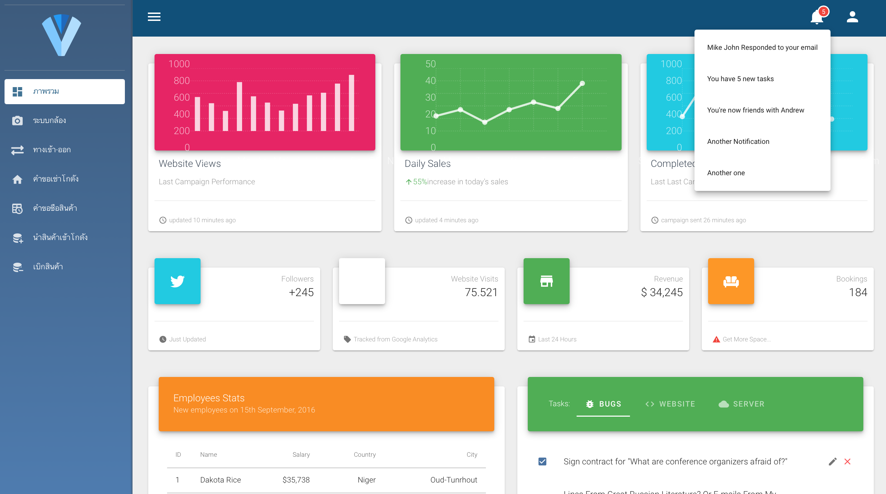
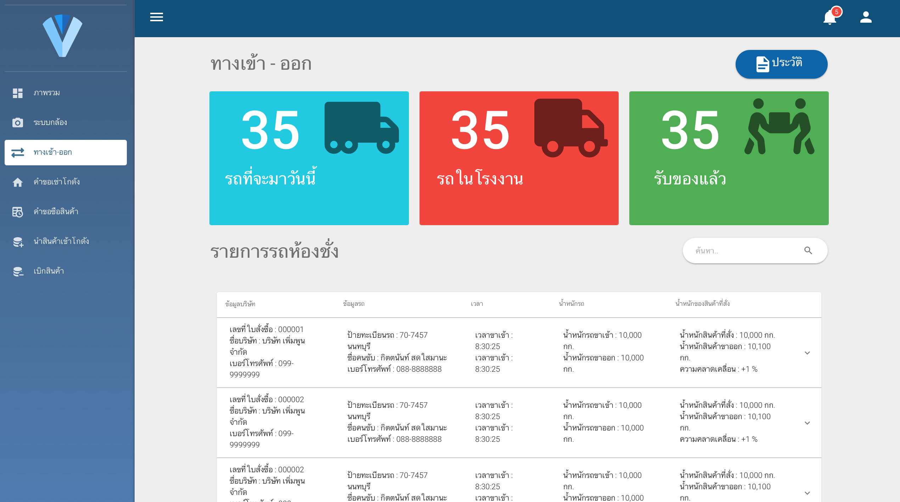

# ระบบ E-Warehouse

## UX/UI frontend-owner
```
cd frontend-owner
npm install
yarn serve
```

### Dashboard
<p align="center">
  
</p>

### EntranceExit
<p align="center">
  
</p>

## Videos
1. [Code This, NOT That](https://www.youtube.com/watch?v=Mus_vwhTCq0&ab_channel=Fireship)

## Links
1. [API docs](https://docs.google.com/document/d/1q6_sfjQ6jyJRovntlbM1WJCFNmN0vhXicqVxJ43BS1Q/edit?usp=sharing)
## Codeing Standard

1. `ใช้ ESLint กำกับการเขียน` ลดการ Ignore ให้มากที่สุด
2. `ลดการใช้ CDN` ให้โหลด Package จาก npm มาแทน
3. `ชื่อตัวแปร/function` ใช้ CamelCase ขึ้นต้นด้วยพิมพ์เล็ก
4. `ชื่อ Class` ขึ้นต้นด้วยพิมพ์ใหญ่ `CamelCase`
5. ชื่อ function ต้องขึ้นต้นด้วย`คำกริยา`
6. `ทุก Function` ต้องเขียนคำอธิบายการทำงาน
7. การคอมเม้นทุกอย่าง `ใช้ภาษาไทย` เท่านั้น
8. ชื่อ Screen ต้องอยู่ใน folder Views เท่านั้น และต้อง`ลงท้ายด้วยคำว่า 'Screen'`
9. ไม่เขียน Function ใส่ในบรรทัดเดียว
10. การใช้ Git commit ต้องขึ้นต้นด้วย `เลข Issue -  รายละเอียดภาษาไทย`
11. ตัวแปรที่รับค่ามาจาก API ต้องตั้งชื่อตาม API Docs
12. ใช้ `single quotes (‘ ’)` ในการใช้กับตัวแปร String
13. `ไม่เขียน semicolons ( ; )`
14. การใช้เครื่องหมายเปรียบเทียบ == หรือ != `เราจะใช้ === และ !== แทน` เนื่องจาก จะเปรียบเทียบค่าไปถึงระดับ type ของตัวแปรนั้นๆ
15. เพื่อความสวยงามของ code และความรู้สึกที่ไม่อึดอัด จึงต้องมี space หลัง comma ( , ) และระหว่างการใช้ infix operation (*, /, +, -, =) รวมไปทั้ง `มี space` หลังจาก if, else if, function อยู่เสมอ
16. ลดการเกิดบัคด้วย `Curly braces ( { } ) `สำหรับการพิมพ์คำสั่งภายใน if statement
